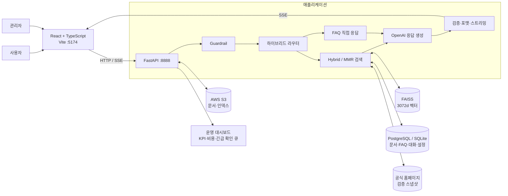

# 엔코아 AI 캠퍼스 상담 챗봇

엔코아 AI 캠퍼스의 과정·지원·운영 정보를 문서와 공식 홈페이지에서 찾아 답하는 운영형 RAG 상담 서비스입니다.

> 최종 정리: 2026-08-13 · 상세 설계와 운영 기록은 [기술 보고서](docs/프로젝트_기술_보고서_2026-08-13.md)에 보관합니다.

## 핵심 결과

| 영역 | 현재 결과 |
| --- | --- |
| 상담 | 사실 질문, 상황 판단, 과정 추천을 분리하고 맥락을 이어 받아 SSE로 실시간 응답 |
| 라우팅 | 명확한 입력은 결정적으로 처리하고 애매한 자연어는 LLM이 의미 기반 분류 |
| 검색 | `text-embedding-3-large` + Hybrid/MMR 검색 + FAISS, 승인 문서와 공식 홈페이지 최신 스냅샷 사용 |
| 최신성 | 과정 상세·신청·소개 페이지를 주기적으로 검증하고 24시간 단위로 갱신 |
| 안전 | 프롬프트 인젝션·개인정보 차단, 법률·범위 밖 질문 거절, 민감 상담의 담당자 연결 |
| 운영 | KPI 분석, 시스템 상태, 비용, 긴급 확인 큐, 답변 재시험과 처리 이력 제공 |
| 로컬 개발 | Python 3.12 + SQLite로 AWS VPC 연결 없이 실행하며, 시작 시 불필요한 전체 재인덱싱을 선택적으로 생략 |
| 관리 | 문서 승인·재색인, FAQ·프롬프트·모델·권한·DB·암호화 설정을 관리자 화면에서 관리 |
| 보안 | Google OAuth/JWT, Fernet 암호화, 감사 로그, 30분 자동 잠금 보안 정보 금고 |

## 품질 지표

저장된 최신 RAGAS 결과는 2026-06-01 평가 파일 기준입니다. 총 102문항 중 87문항을 RAGAS로 채점하고 15문항을 환각·거절 테스트에 사용했습니다.

| 지표 | 최종 측정값 | 해석 |
| --- | ---: | --- |
| Context Recall | **0.9291** | 정답에 필요한 근거 검색률 |
| Context Precision | **0.7459** | 검색 결과 중 유효 근거 비율 |
| Faithfulness | **0.7396** | 답변이 검색 근거에 충실한 정도 |
| Answer Relevancy | **0.0946** | 당시 단일 생성·되묻기 방식의 측정 아티팩트로 품질 판정에서 제외 |
| 환각·거절 자동 통과 | **11/15 (73.33%)** | 기존 수동 판독은 약 14/15, 사실 날조 0건으로 기록 |

라우팅 회귀 검증의 마지막 기록은 **48/48(100%)**입니다. 현재 평가 세트는 51건으로 늘었으므로 아래 명령으로 다시 측정해야 현재 코드의 최신 수치가 됩니다. 또한 위 RAGAS 값은 하이브리드 라우터와 최신 답변 스타일 도입 전 RAG 코어 측정값이므로, 현재 서비스 전체 품질을 나타내는 값으로 확대 해석하지 않습니다.

근거 파일: [`eval_20260601_211844.json`](data/eval_results/eval_20260601_211844.json), [`routing_evalset.json`](data/routing_evalset.json)

## 아키텍처



운영 환경은 AWS EC2의 FastAPI 애플리케이션, Aurora PostgreSQL, S3, OpenAI API로 구성되며 GitHub Actions와 `systemd`로 배포·실행합니다. 로컬에서는 SQLite를 사용할 수 있습니다.

## 로컬 실행

Windows 백엔드는 **Python 3.12.x**를 사용합니다. Python 3.14에서는 전이 의존성인 `scikit-network`의 설치 가능한 wheel을 찾지 못해 전체 설치가 중단될 수 있고, 이 경우 뒤에 있는 `uvicorn`도 설치되지 않습니다. Node.js는 18 이상이 필요하며 전체 AI 기능에는 `OPENAI_API_KEY`가 필요합니다.

### 1. 환경변수

프로젝트 루트에서 최초 한 번 실행합니다.

```bash
cp backend/.env.example backend/.env
cp frontend/.env.example frontend/.env
```

`backend/.env`의 `OPENAI_API_KEY`를 설정하세요. 새 로컬 환경은 예시 파일의 `sqlite:///./chatbot.db`를 그대로 사용할 수 있습니다. 기존 `.env`가 사설 AWS RDS를 가리킨다면, 값을 덮어쓰지 말고 Git에서 제외되는 `backend/.env.local`을 만드세요.

```env
DATABASE_URL=sqlite:///./local-dev.db
WEBSITE_SYNC_ENABLED=false
RAG_INDEX_ON_STARTUP=false
```

`.env.local`은 `.env`보다 우선합니다. `RAG_INDEX_ON_STARTUP=false`는 기존 로컬 FAISS가 있으면 이를 불러오되 서버 시작 때 OpenAI 임베딩 전체 재생성을 하지 않습니다. 문서를 실제로 재색인할 때만 관리자 기능을 사용하거나 이 값을 `true`로 바꿉니다. 관리자 Google 로그인까지 확인하려면 백엔드와 프론트엔드 환경 파일에 같은 Google Client ID를 설정합니다. 실제 비밀값은 Git에 커밋하지 않습니다.

### 2. 백엔드 — Git Bash

첫 번째 터미널에서 실행합니다.

```bash
cd /c/Workspaces2/encore-coa-counselor/backend
python --version                       # 반드시 3.12.x
python -m venv venv
source venv/Scripts/activate
python -m pip install --upgrade pip
python -m pip install -r requirements.txt
python -m uvicorn app.main:app --reload --host 0.0.0.0 --port 8888
```

Git Bash에서는 `C:\Workspaces2\...`와 `.\venv\Scripts\Activate.ps1` 같은 PowerShell 문법을 사용하지 않습니다. 프롬프트에 이미 `/c/Workspaces2/encore-coa-counselor/backend`가 보이면 `cd`는 생략합니다.

이미 `(venv)`가 표시되고 의존성 설치까지 끝났다면 마지막 명령만 실행하면 됩니다.

```bash
python -m uvicorn app.main:app --reload --host 0.0.0.0 --port 8888
```

### 3. 백엔드 — PowerShell

```powershell
cd C:\Workspaces2\encore-coa-counselor\backend
python --version                       # 반드시 3.12.x
python -m venv venv
.\venv\Scripts\Activate.ps1
python -m pip install --upgrade pip
python -m pip install -r requirements.txt
python -m uvicorn app.main:app --reload --host 0.0.0.0 --port 8888
```

PowerShell의 실행 정책 때문에 활성화가 막히면 가상환경 Python을 직접 사용합니다.

```powershell
.\venv\Scripts\python.exe -m pip install -r requirements.txt
.\venv\Scripts\python.exe -m uvicorn app.main:app --reload --host 0.0.0.0 --port 8888
```

### 4. 프론트엔드

두 번째 터미널에서 실행합니다.

```bash
cd frontend
npm install
npm run dev
```

| 서비스 | 주소 |
| --- | --- |
| 프론트엔드 | <http://localhost:5174> |
| 백엔드 상태 | <http://localhost:8888/health> |
| Swagger API 문서 | <http://localhost:8888/docs> |

Windows에서 두 서버를 새 터미널로 한 번에 시작하려면 루트에서 `start_servers.bat` 또는 PowerShell의 `.\start_servers.ps1`을 실행합니다. 종료는 각 서버 터미널에서 `Ctrl+C`입니다.

### 문제 해결

| 증상 | 원인과 조치 |
| --- | --- |
| `Failed to build ... scikit-network` | `python --version`을 확인합니다. 3.14 환경을 계속 사용하지 말고 `venv`를 Python 3.12로 다시 만든 뒤 전체 requirements를 설치합니다. |
| `No module named uvicorn` | `scikit-network` 단계에서 설치가 중단되어 `uvicorn`까지 도달하지 못한 상태입니다. 활성 Python이 `backend/venv`의 3.12인지 확인하고 `python -m pip install -r requirements.txt`를 다시 완료합니다. |
| Git Bash에서 `C:Workspaces...` 또는 `Activate.ps1` 오류 | Git Bash 경로는 `/c/Workspaces2/...`, 활성화는 `source venv/Scripts/activate`입니다. PowerShell 명령과 섞지 않습니다. |
| RDS 연결 timeout (`172.31.x.x`) | 사설 RDS는 로컬 PC에서 직접 접근할 수 없습니다. 로컬 개발은 `.env.local`의 SQLite를 사용하고, RDS가 꼭 필요하면 승인된 VPN·VPC 접속 경로를 사용합니다. |
| 첫 시작이 오래 걸리거나 임베딩 연결 오류 | 로컬 `.env.local`에서 `RAG_INDEX_ON_STARTUP=false`인지 확인합니다. 이 설정에서도 기존 FAISS 인덱스는 로드됩니다. |
| `frontend/dist/assets`가 없음 | 백엔드는 assets가 없어도 시작되도록 처리되어 있습니다. 완성된 화면이 필요하면 `frontend`에서 `npm run build`를 실행합니다. |

정상 기동 확인:

```bash
curl http://localhost:8888/health
# {"status":"healthy"}
```

## 검증 명령

```bash
# 백엔드 단위 테스트
cd backend
python -m unittest discover -s tests -p "test_*.py" -v

# 프론트엔드 타입 검사 + 프로덕션 빌드
cd ../frontend
npm run build

# 프론트엔드 린트
npm run lint
```

OpenAI API를 사용하는 평가 명령은 프로젝트 루트에서 실행합니다.

```bash
python scripts/diag_router.py
python scripts/evaluate_rag.py
```

평가 결과는 `data/eval_results/`에 저장됩니다. 두 명령 모두 API 사용량과 비용이 발생할 수 있습니다.

## 기술 구성

- Frontend: React 18, TypeScript, Vite, Tailwind CSS, Axios
- Backend: FastAPI, Uvicorn, SQLAlchemy, LangChain/LangGraph
- AI/RAG: OpenAI GPT, `text-embedding-3-large`, FAISS, RAGAS
- Data/Infra: SQLite 또는 Aurora PostgreSQL, AWS S3·EC2, GitHub Actions
- Security: Google OAuth 2.0, JWT, Fernet, 관리자 감사 로그

## 주요 폴더

```text
backend/     FastAPI API, RAG·상담·관리 서비스, DB, 테스트
frontend/    React 사용자·관리자 UI
data/        문서, FAQ, 평가 세트와 평가 결과
scripts/     RAGAS, 라우팅 진단, 문서 처리 도구
docs/        상세 기술 보고서
```

상세 API, DB 구조, 보안 설계, 관리자 기능, 배포 구성과 변경 배경은 [기술 보고서](docs/프로젝트_기술_보고서_2026-08-13.md)에서 확인할 수 있습니다. 환경변수·GitHub Secrets·관리자 설정을 어떻게 재구성할지는 [환경설정 관리 구조 검토 보고서](docs/환경설정_비밀정보_관리_구조_검토_보고서_2026-08-13.md)에 결정 전 검토안으로 정리했습니다.
