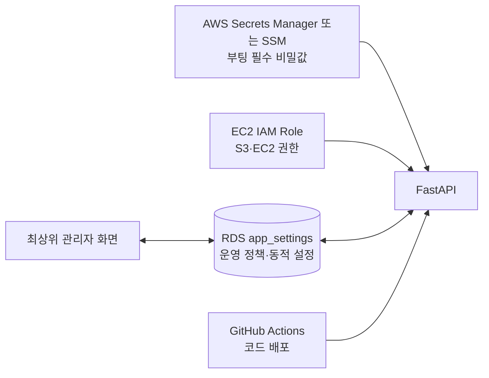

# 환경설정·비밀정보 관리 구조 검토 보고서

> 상태: **의사결정 대기**  
> 기준일: 2026-08-13  
> 범위: 로컬 `.env`, `.env.example`, `.env.local`, GitHub Actions Secrets, 관리자 설정 화면  
> 주의: 이 문서는 개선 검토안이며 실제 환경값·배포 방식·관리자 권한은 변경하지 않았다.

## 1. 검토 목적

현재 서비스는 로컬 개발에서는 `.env`와 `.env.local`, 운영에서는 GitHub Actions Secrets로 생성한 EC2의 `.env`, 일부 동적 설정은 RDS `app_settings`를 사용한다. 설정 원본이 여러 곳에 나뉘어 있어 다음 질문을 검토했다.

- 운영 서버의 `.env` 파일을 없앨 수 있는가?
- 모든 값을 최상위 관리자가 관리자 페이지에서 추가·수정·삭제하게 해도 되는가?
- 어떤 값은 서버 시작 전부터 반드시 외부에 존재해야 하는가?
- 인수인계용 `.env.example`에는 무엇을 기록해야 하는가?
- 로컬 `.env.local`을 계속 유지할 필요가 있는가?

## 2. 결론 요약

**운영 `.env` 파일은 장기적으로 제거할 수 있지만, 환경변수와 외부 비밀 저장소 자체를 모두 제거할 수는 없다. 모든 설정을 관리자 페이지에서 CRUD하는 방식도 권장하지 않는다.**

권장 목표는 다음과 같은 혼합 구조다.



- **부팅·로그인·복호화에 필수인 값**: AWS Secrets Manager/SSM 같은 앱 외부 저장소
- **자주 변경하는 비밀이 아닌 운영 정책**: RDS `app_settings`와 관리자 화면
- **AWS 접근권한**: 장기 Access Key 대신 EC2 IAM Role
- **로컬 개발값**: Git에서 제외된 `backend/.env` 하나
- **인수인계 계약서**: 실제 값이 없는 `.env.example`
- **운영 EC2의 평문 `.env`**: 위 구조가 완성된 뒤 제거 검토

## 3. 현재 구조

### 3.1 로컬

| 파일 | 현재 역할 | Git 상태 |
| --- | --- | --- |
| `backend/.env` | 로컬 백엔드의 실제 키와 설정 | 제외 |
| `backend/.env.local` | SQLite·홈페이지 동기화·시작 재색인 override | 제외 |
| `backend/.env.example` | 백엔드 설정 템플릿 | 추적 |
| `frontend/.env` | 로컬 Google OAuth Client ID | 제외 |
| `frontend/.env.example` | 프론트 설정 템플릿 | 추적 |

현재 `app/config.py`는 `.env`를 읽은 뒤 `.env.local`을 `override=True`로 읽는다. 따라서 같은 키가 양쪽에 있으면 `.env.local`이 최종 적용된다.

### 3.2 운영

현재 `.github/workflows/deploy.yml`은 GitHub Actions Secrets를 job 환경변수로 받은 뒤 EC2의 `backend/.env`와 `frontend/.env`를 매 배포마다 새로 생성한다.

```text
GitHub Actions Secrets
        ↓ 배포
EC2 backend/.env / frontend/.env
        ↓ 재시작
FastAPI / React 정적 빌드
```

따라서 현재 운영 설정의 실질적인 원본은 **GitHub Actions Secrets와 workflow의 하드코딩 값**이다. EC2나 관리자 화면에서 `.env`를 직접 수정해도 다음 배포에서 되돌아갈 수 있다.

### 3.3 RDS 동적 설정

생성 모델은 이미 `app_settings.active_model_name`을 우선 사용한다. 이는 배포가 `.env`를 다시 생성해도 관리자 화면에서 선택한 모델이 유지되도록 개선된 구조다. 다른 동적 설정도 이 패턴으로 옮길 수 있다.

## 4. 발견된 구조적 문제

### 4.1 관리자 화면의 `.env` 직접 수정은 신뢰할 수 있는 영구 저장이 아님

현재 일부 API는 다음 값을 `backend/.env`에 직접 기록한다.

- `ADMIN_EMAIL`
- `ADMIN_PASSWORD`
- `ENCRYPT_FAQ`
- `ENCRYPT_PROMPT`
- `ENCRYPT_DOCUMENT`

문제는 다음과 같다.

1. 다음 GitHub 배포가 `.env`를 다시 생성하면 변경값이 사라질 수 있다.
2. 프로세스 시작 때 `.env` 값이 이미 `os.environ`에 적재되므로 파일만 수정하고 설정 캐시를 비워도 현재 프로세스에 즉시 반영되지 않을 수 있다.
3. 로컬에서는 `.env.local`이 같은 키를 다시 덮어쓸 수 있다.
4. 여러 워커·인스턴스가 있으면 한 서버의 로컬 파일 변경이 다른 프로세스에 전달되지 않는다.

따라서 관리자 화면에서 변경할 값은 `.env`가 아니라 RDS 같은 공유 저장소를 단일 원본으로 사용해야 한다.

### 4.2 관리자 화면만으로 모든 값을 관리하면 복구 불가능한 순환 의존성이 생김

관리자 화면을 열기 위해서는 먼저 앱이 시작되고, DB에 연결하고, Google 로그인을 검증해야 한다. 그런데 그 과정에 필요한 값까지 관리자 DB에만 넣으면 다음 순환이 생긴다.

```text
DB 연결값 필요 → 앱 시작 필요 → 관리자 로그인 필요 → 설정 화면에서 DB 연결값 입력
```

`DATABASE_URL`, 복호화 루트 키, 인증 서명키 등은 앱 밖에 최소 bootstrap 값으로 남아야 한다.

### 4.3 프론트 Google Client ID는 현재 빌드 시점 설정

`VITE_GOOGLE_CLIENT_ID`는 Vite 빌드 시 JavaScript 번들에 포함된다. 관리자 화면에서 값을 바꿔도 이미 빌드된 프론트에는 적용되지 않는다. 관리자 변경을 지원하려면 다음 중 하나가 필요하다.

- 변경 후 프론트 재빌드·배포
- `/runtime-config` 같은 공개 설정 endpoint를 시작 시 조회하도록 프론트 구조 변경

Google Client ID는 비밀값은 아니지만 인증 동작에 필수다.

### 4.4 AWS 인프라 식별자가 workflow와 코드에 일부 하드코딩됨

EC2 인스턴스 ID 등 비밀이 아닌 운영값이 workflow 또는 관리자 보안정보 기본값에 직접 들어 있다. AWS 계정 이관 시 누락 위험이 있으므로 GitHub Variables 또는 RDS 운영 설정으로 옮겨야 한다.

## 5. 설정 분류

### 5.1 앱 외부에 반드시 남겨야 하는 bootstrap 값

| 키 | 필요한 시점 | 관리자 CRUD 적합성 | 권장 보관 |
| --- | --- | --- | --- |
| `DATABASE_URL` | 앱 import·DB 엔진 생성 전 | 부적합 | Secrets Manager/SSM |
| `ENCRYPTION_KEY` | 기존 암호문 복호화 전 | 일반 CRUD 금지 | Secrets Manager/SSM + 별도 복구 금고 |
| `JWT_SECRET` | 관리자 토큰 발급·검증 전 | 삭제 금지, 회전만 허용 | Secrets Manager/SSM |
| `GOOGLE_CLIENT_ID` | 최초 관리자 로그인 전 | 제한적 교체 | SSM 또는 runtime 공개 설정 |
| 최초 관리자 bootstrap 정보 | 최초 관리자 허용 전 | 마지막 관리자 삭제 금지 | SSM 또는 1회용 bootstrap 절차 |

`ENCRYPTION_KEY`는 기존 RDS 데이터를 유지하는 동안 임의로 재발급하면 안 된다. 변경하려면 기존 키로 복호화하고 새 키로 다시 암호화하는 전용 마이그레이션과 롤백 계획이 필요하다.

### 5.2 관리자 화면으로 이전하기 적합한 동적 설정

| 키 | 이유 | 적용 방식 |
| --- | --- | --- |
| `MODEL_NAME` | 이미 RDS 우선 구조 | 현행 유지 |
| `INTENT_MODEL_NAME` | 운영 중 모델 교체 가능 | RDS + 입력 검증 |
| `CHANNEL_TALK_URL` | 상담 채널 변경 가능 | RDS + URL 검증 |
| `HOMEPAGE_URL` | 공식 홈페이지 변경 가능 | RDS + URL 검증 |
| `LINK_TRACKING_PARAMS` | 캠페인 정책 변경 가능 | RDS + 허용 키 검증 |
| `WEBSITE_SYNC_ENABLED` | 운영 기능 on/off | RDS |
| `WEBSITE_SYNC_INTERVAL_HOURS` | 운영 주기 변경 | RDS + 범위 제한 |
| `WEBSITE_FETCH_TIMEOUT_SECONDS` | 네트워크 정책 변경 | RDS + 범위 제한 |
| `VERIFY_THRESHOLD` | 검색 검증 튜닝 | RDS + 숫자 범위 검증 |
| `AWS_REGION` | 인프라 위치 정보 | GitHub Variable 또는 RDS |
| `AWS_S3_BUCKET` | 저장소 위치 | 제한적 관리자 변경 + 연결 테스트 |
| `AWS_S3_PREFIX` | 저장 경로 | 제한적 관리자 변경 + 경로 검증 |
| `AWS_EC2_INSTANCE_ID` | 운영 상태 조회 대상 | GitHub Variable 또는 RDS |

`RAG_INDEX_ON_STARTUP`은 저장할 수 있지만 앱 시작 시 읽는 설정이므로 화면에 **재시작 필요**를 명시해야 한다.

### 5.3 제한적으로 교체 가능한 외부 서비스 비밀값

| 키 | 관리자 변경 가능 여부 | 필수 보호장치 |
| --- | --- | --- |
| `OPENAI_API_KEY` | 가능 | 최상위 관리자 재인증, 연결 테스트, 마스킹, 감사 로그, 롤백 |
| `LANGSMITH_API_KEY` | 가능 | 연결 테스트, 마스킹, 감사 로그 |
| 기타 외부 API 비밀 | 가능 | 서비스별 검증과 실패 시 기존 값 유지 |

비밀값은 RDS 일반 설정 테이블에 평문으로 저장하지 않는다. Secrets Manager의 secret version을 갱신하거나, 최소한 별도의 키로 암호화된 전용 저장소를 사용해야 한다.

### 5.4 환경설정에서 제거하거나 정리할 항목

| 키 | 판단 | 근거 |
| --- | --- | --- |
| `ADMIN_PASSWORD` | 제거 후보 | Google OAuth 인증에는 사용되지 않는 레거시 값과 API만 남음 |
| 백엔드의 `VITE_GOOGLE_CLIENT_ID` | 제거 | 프론트 전용. 백엔드는 `GOOGLE_CLIENT_ID` 사용 |
| `LANGSMITH_TRACING_V2` | 이름 교체 | 호환은 되지만 표준 `LANGSMITH_TRACING` 사용 권장 |
| `REJECT_THRESHOLD` | 제거 후보 | 현재 하드 거절 경로에서 미사용, 호환 정의만 유지 |
| `RAG_INDEX_ON_STARTUP` 중복 | 한 곳으로 통합 | 현재 `.env`와 `.env.local`에 중복될 수 있음 |

## 6. `.env.example` 인수인계 기준

`.env.example`은 실행 파일이 아니라 **환경설정 계약서**로 유지해야 한다. 각 키에 다음 정보가 있어야 한다.

- 필수/선택 여부
- 로컬/운영 사용 범위
- 비밀 여부
- 값을 발급하거나 확인하는 시스템
- 변경 후 재시작·재빌드 필요 여부
- 기존 값 보존 여부

현재 템플릿에는 최소 다음 항목을 보완해야 한다.

```env
# 관리자 인증 — 운영 필수
GOOGLE_CLIENT_ID=
JWT_SECRET=
ADMIN_EMAIL=

# 암호화 정책
ENCRYPT_FAQ=true
ENCRYPT_PROMPT=true
ENCRYPT_DOCUMENT=true

# 검색·공식 링크 정책
VERIFY_THRESHOLD=3.5
HOMEPAGE_URL=https://encorecampus.ai/
LINK_TRACKING_PARAMS=utm_source=chatbot&utm_medium=referral
```

추가 정합성 개선:

- `MODEL_NAME`을 코드·운영 기본값과 일치시킨다.
- `LANGSMITH_TRACING_V2`를 `LANGSMITH_TRACING`으로 바꾼다.
- `ADMIN_PASSWORD`는 레거시 제거 결정 후 템플릿·workflow·API에서 함께 삭제한다.
- 실제 이메일, Client ID, 계정번호, 인스턴스 ID, bucket 이름은 예제에 넣지 않는다.

## 7. `.env.local` 처리안

### 선택안 A — 유지

장점:

- 운영 `.env`를 복사해 둔 개발 PC에서 SQLite 값만 간단히 override 가능
- 개발자별 차이를 별도 파일로 분리 가능

단점:

- `.env`와 중복되어 실제 적용값을 파악하기 어려움
- 운영 EC2에 파일이 실수로 남으면 GitHub Secrets로 생성한 `.env`를 덮어쓸 수 있음
- 관리자 화면의 `.env` 수정과 충돌

유지한다면 `APP_ENV=development`일 때만 로드하고, 운영 시작 시 `.env.local`이 존재하면 실패하도록 보호장치를 두는 것이 좋다.

### 선택안 B — 제거 및 `.env`로 통합 (로컬 권장)

```text
backend/.env          로컬 실제 설정 한 곳
backend/.env.example  인수인계 템플릿
```

로컬 `.env`에 SQLite, 동기화 비활성화, 시작 재색인 비활성화를 함께 둔다. 설정 출처가 단순해지고 장애 확인이 쉬워진다.

**현재 검토 권고는 선택안 B**다. 단, 운영 secret 외부화 작업과는 별개로 진행할 수 있다.

## 8. 대안 비교

| 대안 | 설명 | 장점 | 위험 | 판단 |
| --- | --- | --- | --- | --- |
| A. 현행 유지 | GitHub Secrets가 EC2 `.env` 생성 | 변경 적음 | 원본 분산, 배포 시 덮어쓰기, 평문 파일 | 단기 유지 가능 |
| B. 혼합 구조 | bootstrap secret은 외부 저장소, 동적 설정은 RDS | 복구 가능성·운영성 균형 | 초기 구현 필요 | **권장** |
| C. 모든 값을 관리자 DB에서 CRUD | 비밀·설정 전부 관리자 화면 | 화면상 단순 | 부팅·로그인 순환 의존, DB 장애 시 전체 잠김 | 권장하지 않음 |
| D. 모든 값을 GitHub Secrets로만 관리 | 운영값을 배포 시 주입 | 접근 통제 단순 | 설정 변경마다 배포, 관리자 기능과 충돌 | 작은 서비스에 한정 |

## 9. 권장 전환 단계

### 0단계 — 결정 전

- 이 보고서의 키 분류와 소유 부서를 확정한다.
- 플레이데이터 AWS·OpenAI·Google·LangSmith·상담 채널 소유권을 확인한다.
- `ENCRYPTION_KEY`와 RDS/S3 백업의 복구 가능성을 확인한다.

### 1단계 — 저위험 정리

- `.env.example`을 완전한 인수인계 템플릿으로 보완한다.
- 로컬 `.env.local`을 `.env`로 통합하고 로딩 코드를 단순화한다.
- 비표준·중복·레거시 키를 제거한다.
- GitHub Secrets와 Variables를 비밀/비비밀 기준으로 분리한다.

### 2단계 — 동적 설정의 RDS 이전

- 모델 외 운영 정책을 `app_settings`로 이전한다.
- 최상위 관리자 전용 CRUD, 값 검증, 감사 로그를 구현한다.
- 재시작·재색인·프론트 재빌드가 필요한 설정을 화면에서 구분한다.
- 관리자 `.env` 직접 쓰기 API를 제거한다.

### 3단계 — AWS 자격증명 개선

- EC2 IAM Role에 필요한 최소 S3·EC2 조회 권한을 부여한다.
- `AWS_ACCESS_KEY_ID`, `AWS_SECRET_ACCESS_KEY` 의존성을 제거한다.
- 기존 장기 키를 비활성화하기 전에 업로드·다운로드·상태 조회를 검증한다.

### 4단계 — 운영 `.env` 제거

- bootstrap secret을 Secrets Manager/SSM에서 시작 시 주입한다.
- systemd 단위에서 읽거나 애플리케이션 bootstrap loader를 사용한다.
- 새 인스턴스에서 무인 재시작과 장애 복구를 검증한다.
- 검증 완료 후 EC2의 평문 `.env` 생성을 workflow에서 제거한다.

## 10. 관리자 화면 안전 요구사항

최상위 관리자라고 해도 모든 값의 무제한 삭제를 허용하지 않는다.

- 중요한 변경 전 Google 재인증 또는 별도 보안 금고 재인증
- 비밀값은 전체 재표시 금지, 마스킹과 교체만 허용
- 새 값 연결 테스트 성공 후에만 활성화
- 실패 시 기존 값 유지
- 모든 변경에 작업자·시각·이전 버전·결과 감사 로그
- 마지막 최상위 관리자 삭제 금지
- `JWT_SECRET` 변경 시 전체 세션 만료 경고
- `ENCRYPTION_KEY` 일반 수정·삭제 금지
- `DATABASE_URL` 관리자 화면 변경 금지
- 재시작·재빌드·재색인이 필요한 설정에 영향 표시
- 두 인스턴스 이상에서 동일하게 반영되는 공유 저장소 사용

## 11. 롤백 및 완료 조건

### 롤백 준비

- 변경 전 GitHub Secrets 이름 목록과 배포 성공 commit 기록
- RDS snapshot과 S3 버전/백업 확인
- 기존 `ENCRYPTION_KEY` 별도 보관
- 기존 systemd 환경 로딩 방식 보존
- 새 secret version 실패 시 직전 version으로 전환 가능하게 구성

### 완료 조건

- EC2 재부팅 후 수동 파일 편집 없이 서비스가 시작된다.
- `/health`, 일반 채팅, RAG 질문, 관리자 Google 로그인이 정상이다.
- 관리자 설정 변경이 재배포·재시작 후에도 유지된다.
- DB 또는 외부 API 오류 시 관리자 설정 자체가 손실되지 않는다.
- 기존 암호화 데이터가 모두 정상 복호화된다.
- S3 문서 업로드·읽기와 FAISS 복구가 IAM Role로 동작한다.
- 새 담당자가 `.env.example`과 운영 자산대장만 보고 설정 위치와 발급 주체를 설명할 수 있다.

## 12. 결정 체크리스트

아래 항목에 합의한 뒤 구현을 시작한다.

- [ ] 운영 secret 저장소를 AWS Secrets Manager와 SSM 중 무엇으로 할지
- [ ] 로컬 `.env.local`을 제거할지, 개발 모드 한정으로 유지할지
- [ ] 관리자 화면으로 옮길 설정 범위
- [ ] `ADMIN_PASSWORD` 레거시 API 제거 여부
- [ ] 최상위 관리자 bootstrap·복구 방식
- [ ] Google Client ID 런타임 로딩 또는 프론트 재빌드 방식
- [ ] AWS Access Key를 EC2 IAM Role로 교체할 일정
- [ ] `ENCRYPTION_KEY` 보관 책임자와 재암호화 절차
- [ ] GitHub 저장소·Secrets·runner의 플레이데이터 소유권 이전 일정
- [ ] 장애 시 최종 승인자와 롤백 담당자

## 13. 현재 권고안

당장은 운영 `.env`를 즉시 삭제하지 않는다. 먼저 다음 순서로 결정·구현하는 것이 안전하다.

1. `.env.example`과 GitHub Secrets/Variables 목록을 인수인계 기준으로 정리
2. 로컬 `.env.local` 중복 제거
3. 관리자 `.env` 직접 수정 기능을 RDS 설정으로 이전
4. EC2 IAM Role 적용
5. bootstrap secret을 Secrets Manager/SSM으로 이동
6. 무인 재시작·복구 검증 후 운영 `.env` 제거

이 순서는 서비스가 시작되지 않아 관리자 화면에도 들어갈 수 없는 상태를 피하면서, 최종적으로는 EC2 평문 파일과 개인 계정 키 의존성을 줄인다.
